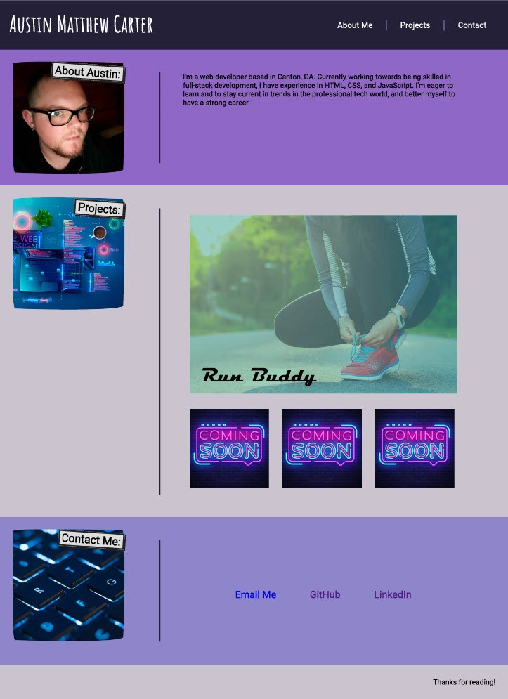

# AUSTIN CARTER PORTFOLIO

A portfolio for me to display the projects I've created. Inside this page is a section telling about myself, showcasing different projects that have been made, and ways to contact me.

## NAVIGATION

The top of the page has navigation buttons that will take the user to the different sections of the page. Click whichever section you'd like to view and you will be taken directly to that section.

## PROJECTS SECTION

The projects section includes currently launched projects, as well as placeholders for future projects to be added later. Click any of the images to be taken to the site shown in the thumbnail.

## CONTACT

This section contains links where you can contact me and find more info about me. The "email me" button will take you to your default email client and pre-fill my email address. The LinkedIn and GitHub buttons will take you to my profile. on each of these websites. 

## FUNCTIONALITY

The page will adjust according to the size of the user's screen. As the screen-size becomes smaller, font-size will increase, and side-by-side elements will become vertical to allow wider spaces for text and other content. 

## TECHNOLOGIES USED
The page is built using HTML and CSS.

